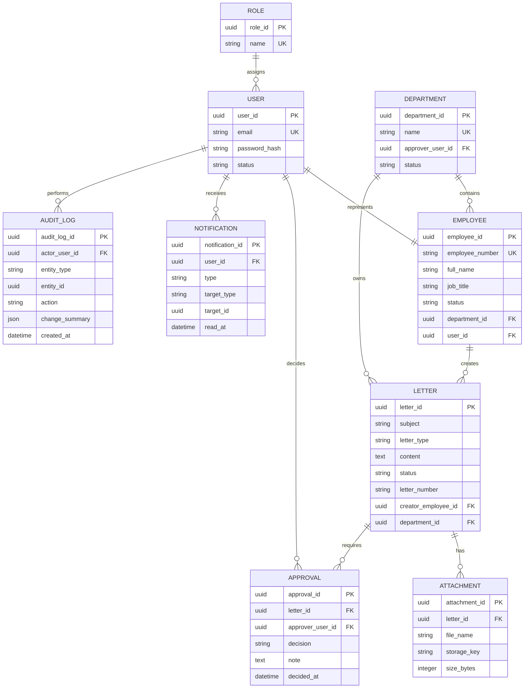

# Supporting Documents: E-Office

## A. Role & Permission Matrix

Legenda: **C** create, **R** read, **U** update, **D** deactivate, **A** approve/decide, **-** tidak diizinkan.

| Modul / tindakan | Staff | Manager/Approver | HR/Admin | Management |
|---|---|---|---|---|
| Dashboard | R pribadi | R antrean | R operasional | R agregat |
| Data pegawai | R profil sendiri* | R anggota unit* | C/R/U/D semua | R agregat saja |
| Departemen dan role | - | - | C/R/U/D | - |
| Surat sendiri | C/R/U Draft atau Need Revision | R bila ditugaskan | R administratif** | - |
| Surat ditugaskan | - | R/A | R administratif** | R agregat saja |
| Lampiran surat | C/R sesuai surat | R sesuai assignment | R administratif** | - |
| Approval | - | R/A untuk assignment sendiri | R status saja** | - |
| Audit log | - | - | R | - |

*Batas data profil/unit merupakan Assumption dan perlu kebijakan privasi. **Akses administratif HR perlu ditentukan lebih lanjut, termasuk apakah dapat melihat isi surat rahasia.

## B. ERD / Data Model

Catatan model: `letter_number` dapat kosong sampai Approved. Password tidak pernah disimpan dalam bentuk plain text. Strategi penyimpanan lampiran, retensi, enkripsi, dan klasifikasi surat adalah Open Question.

## C. UAT Scenario

| ID | Skenario | Precondition | Langkah utama | Hasil yang diharapkan |
|---|---|---|---|---|
| UAT-01 | Login berbasis role | Akun Staff aktif | Login dengan kredensial valid | Dashboard Staff terbuka; menu admin tidak tersedia. |
| UAT-02 | Tambah pegawai | HR/Admin login | Isi semua field wajib dan Save | Pegawai tampil aktif dan audit log tercatat. |
| UAT-03 | Cegah email duplikat | Email sudah ada | Tambah pegawai dengan email sama | Simpan ditolak dengan pesan field email. |
| UAT-04 | Submit surat | Staff dan approver departemen aktif | Buat surat valid, unggah lampiran, Submit | Status Pending Approval; approval dan notifikasi dibuat. |
| UAT-05 | Request revision | Approval Pending tersedia | Manager pilih Request Revision dan isi catatan | Status Need Revision; Staff menerima notifikasi dan dapat mengedit. |
| UAT-06 | Approve surat | Surat Pending milik Manager | Manager pilih Approve | Status Approved; riwayat, audit, dan notifikasi tercatat. |
| UAT-07 | Proteksi akses | Staff login | Buka URL Employee Management | Akses dan data ditolak. |
| UAT-08 | Dashboard Management | User Management login | Buka Dashboard | Indikator agregat tampil tanpa aksi ubah/approval. |

## D. Risk Register

| ID | Risk | Impact | Likelihood | Risk Level | Mitigation |
|---|---|---|---|---|---|
| R-01 | Data pegawai awal tidak lengkap/duplikat | Tinggi | Sedang | Tinggi | Data profiling, owner HR, template import, dan validasi sebelum pilot. |
| R-02 | Staff tetap memakai proses lama | Tinggi | Sedang | Tinggi | Pilot terbatas, pelatihan singkat, panduan kerja, dan metrik adopsi mingguan. |
| R-03 | Approval tertunda | Sedang | Tinggi | Tinggi | Dashboard queue, notifikasi, SLA operasional yang disepakati sponsor. |
| R-04 | Akses data melebihi kewenangan | Tinggi | Sedang | Tinggi | Role matrix, pemeriksaan server-side, audit log, dan UAT keamanan. |
| R-05 | Kebijakan nomor/retensi surat belum jelas | Sedang | Sedang | Sedang | Tetapkan decision owner dan selesaikan Open Question sebelum production release. |
| R-06 | Kebutuhan multi-level approval muncul saat build | Sedang | Sedang | Sedang | Tegaskan MVP satu tingkat, desain data extensible, backlog phase berikutnya. |
| R-07 | Lampiran mengandung file berbahaya | Tinggi | Rendah | Sedang | Allowlist format, batas ukuran, malware scanning sesuai kemampuan IT. |

## E. Product Roadmap

| Fase | Periode indikatif* | Outcome | Dependensi / exit criteria |
|---|---|---|---|
| Discovery & foundation | Minggu 1–2 | Validasi proses, role, kebijakan data, baseline metric | Sponsor menyetujui Open Question utama dan pilot unit. |
| MVP build | Minggu 3–8 | F-01 sampai F-06 dasar tersedia | Data model, aturan approval satu tingkat, lingkungan uji. |
| UAT & pilot | Minggu 9–10 | UAT skenario inti dan pilot terbatas | Data pegawai pilot dibersihkan; pengguna dilatih. |
| Go-live & measure | Minggu 11–12 | Rilis pilot dan pengukuran KPI | UAT kritis lulus, support owner dan rollback plan tersedia. |
| Iteration | Pasca-pilot | Template, email, export, integrasi/approval lanjutan yang tervalidasi | Temuan pilot dan prioritas bisnis. |

*Estimasi hanya untuk menyatakan urutan dependency, bukan komitmen jadwal karena tim, integrasi, dan volume belum diketahui.
